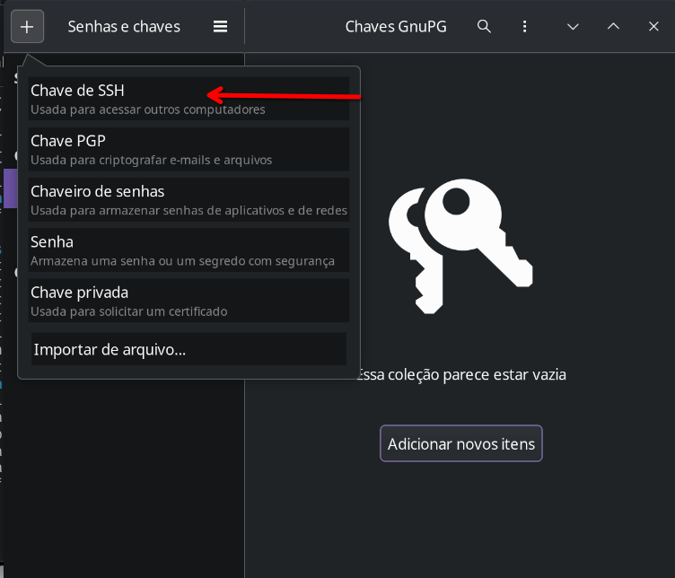
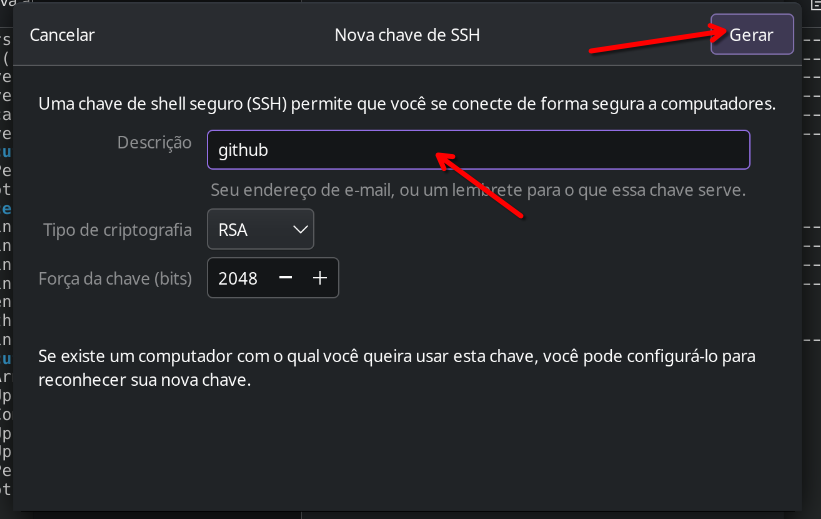
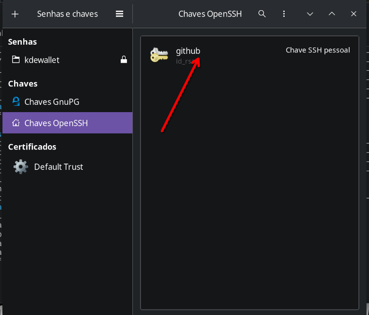

# Leia-me

Antes de rodar o projeto, você precisará de alguns pré-requisitos:
- Python >= 3.11
- git

## Configurando o projeto no Linux
Se você utiliza um sistema Linux, o python já vem instalado por padrão, basta instalar o gerenciador de ambiente virtual. Em algumas distros (como no Fedora e no Arch) esse gerenciador já vem por padrão, mas, se você utiliza **Debian**/**Ubuntu** e derivados, precisará do pacote específico.

~~~ bash
sudo apt update # Atualizando a lista de pacotes
sudo apt install python3-venv
~~~

## Preparação
No linux, além do git eu recomendo fortemente instalar um pacote chamado *seahorse*, que vai permitir o gerenciamento gráfico das nossas chaves *SSH* (falarei disso mais adiante). 

Os comandos abaixo instalam tanto o **git** quanto o **seahorse** no seu sistema:

#### Ubuntu
~~~ bash
sudo apt install git seahorse
~~~

#### Fedora
~~~ bash
sudo dnf install git seahorse
~~~

#### ArchLinux
~~~ bash
sudo pacman -S git seahorse
~~~

Após instalados esses pacotes, você perceberá que um novo programa vai aparecer no seu *menu de aplicativos*. Ele pode se chamar **Passwords and keys** ou **Senhas e chaves** dependendo do idioma configurado.

## Criando uma nova chave via interface gráfica
Ao abrir o programa senhas e chaves, vamos adicionar uma nova chave de ssh clicando no botão **+** superior direito e selecionando a opção **chave de ssh**

Após isso, precisamos definir uma descrição para a nossa chave. Também podemos alterar o tipo de chave e a força da chave, mas para nosso exemplo o padrão será suficiente.

Será solicitado uma senha para a chave, e uma confirmação da mesma logo em seguida. Após isso, podemos conferir se tudo deu certo se nossa chave criada aparecer na tela inicial.

## Configurando o projeto no Windows

[TODO]

# Rodando o Projeto
1 - Criar um ambiente virtual

~~~ bash
python3 -m venv .venv
~~~

2 - Ativar o ambiente

~~~ bash
source .venv/bin/activate
~~~

3 - Instalar as dependências
~~~ bash
pip install -r requirements.txt
~~~

4 - Rodar o projeto
~~~
fastapi dev main.py
~~~